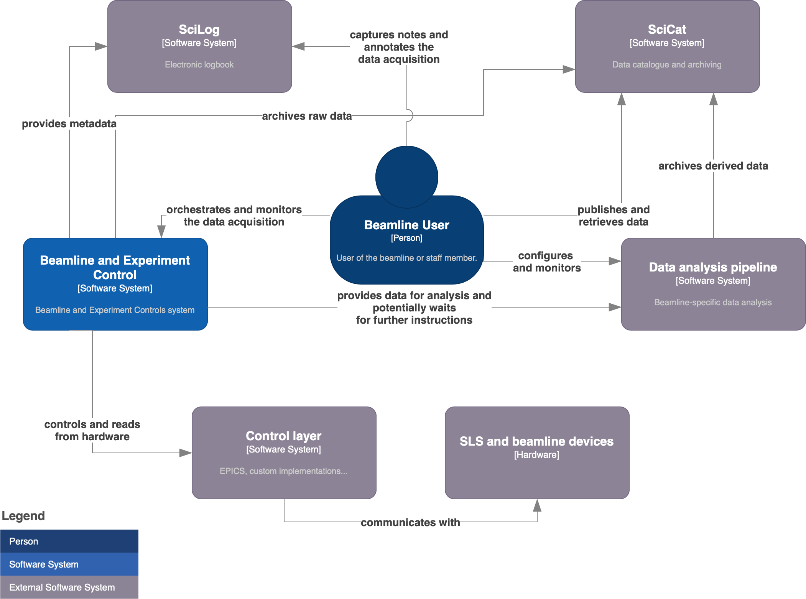

Introduction
-------------

BEC is a **B**\ eamline **E**\ xperiment **C**\ ontrol system that relies on multiple small services for orchestrating and steering the experiment at large research facilities. The usage of small services allows for a more modular system and facilitates the long-term maintainability. 

Multiple users can be connected to the system at the same time while the scan server uses a queue to schedule the requests received from users or other services such as feedback loops from automatic data-processing pipelines. 

