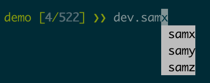

Tutorial
========

Client
------------------------

    Please activate the proper environment as needed.

Device access
~~~~~~~~~~~~~~~~~

Devices are grouped in `dev`. This allows users to use tab-completion for finding devices.



.. hint:: `dev` is imported as a builtin. As a result, you can access `dev` from everywhere. `dev` itself is just an alias for `bec.device_manager.devices`.

Inspect a device
~~~~~~~~~~~~~~~~~

.. code-block:: ipython

    LamNI [2/522] >> dev.samx

    Out[2]:
            Positioner(name=samx, enabled=True):
            --------------------
            Details:
                Status: enabled
                Last recorded value: {'value': 0, 'timestamp': 1671796007.547235}
                Device class: SynAxisOPAAS
                Acquisition group: motor
                Acquisition readoutPriority: monitored
                Device tags: ['user motors']
                User parameter: None
            --------------------
            Config:
                delay: 1
                labels: samx
                limits: [-50, 50]
                name: samx
                speed: 100
                tolerance: 0.01
                update_frequency: 400


Move a motor
~~~~~~~~~~~~~~

There are two variants of device movements: `updated move` and `move`.


Updated move (umv)
^^^^^^^^^^^^^^^^^^
A umv command blocks the command-line until the motor arrives at the target position (or an error occurs).

.. code-block:: python

    scans.umv(dev.samx, 5, relative=False)

Move (mv)
^^^^^^^^^^^^^^^^^^
A mv command is non-blocking, i.e. it does not wait until the motor reaches the target position. 

.. code-block:: python

    scans.mv(dev.samx, 5, relative=False)

However, it can be made a blocking call by 

.. code-block:: python

    scans.mv(dev.samx, 5, relative=False).wait()

The same mv command can also be executed by calling the device method `move`

.. code-block:: python

    dev.samx.move(5, relative=False)


.. note:: mv and umv can receive multiple devices, e.g. 

    .. code-block:: python
        
        scans.umv(dev.samx, 5, dev.samy, 10, relative=False)


Run a scan
~~~~~~~~~~~

All currently available scans are accessible through `scans.`, e.g.

.. code-block:: python

    s = scans.line_scan(dev.samx, -5, 5, steps=10, exp_time=0.1, relative=False)


.. 
    ### 3.2.3 Run a software based fly scan [TODO: MORE DETAILS]
    ```
    scans.round_scan_fly?
    scans.round_scan_fly(dev.flyer_sim, 0, 50, 5, 3, exp_time=0.1, relative=True)
    ```

Inspect the scan data
~~~~~~~~~~~~~~~~~~~~~~~~

The return value of a scan is a python object of type `ScanReport`. All data is stored in `<scan_report>.scan.data`, e.g.

.. code-block:: python

    s = scans.line_scan(dev.samx, -5, 5, steps=10, exp_time=0.1, relative=False)
    print(s.scan.data) # print the scan data

Setup and configuration
------------------------

Instead of using :file:`update_session.py` (cf.  :ref:`update_session` ) you can also the bec_client to update the current session. With the bec_client running, use

.. code-block:: python

    bec.device_manager._scibec.update_session_with_file(<my-config.yaml>)

You can also use SciBec directly:

.. code-block:: python

    from bec_utils import SciBec
    scibec = SciBec()
    scibec.url = scibec_host_and_port # only needed if SciBec is not running on localhost, port 3030
    scibec.update_session_with_file(<my-config.yaml>)


Alternatively, use the bec_client to update the configuration of current session in mongo database and save to a file

Please start bec_client using ipython (starting from "bec" folder) as needed:

.. code-block:: bash

    cd bec_client
    ipython

Once started, run 

.. code-block:: python

    %run demo.py


To disable a device (e.g. samx), use

.. code-block:: python

    dev.samx.enabled=False # this disabled the device samx on all services and MongoDB

To update the device config, use

.. code-block:: python

    dev.samx.set_device_config({"tolerance":0.02})

To save the current session to disk, use

.. code-block:: python

    bec.config.save_current_session("./config_saved.yaml") # this will save a file bec_client/config_saved.yaml


.. 
    ### 3.1.3 [TODO: TO BE DEVELOPED] Use **Web GUI tool** to update the configuration of current session in mongo database


